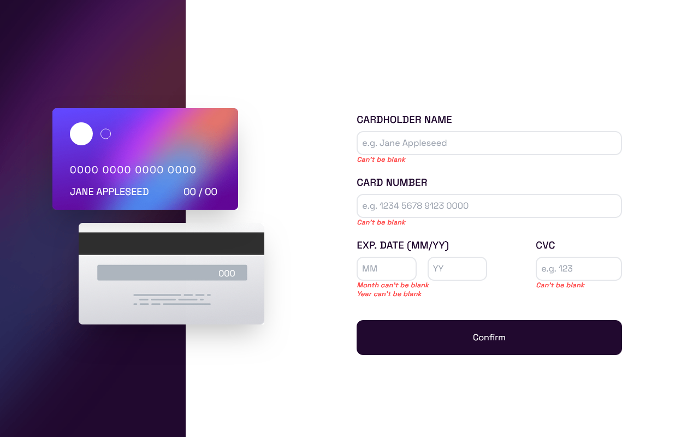

# Interactive card details form

  

  

Your users should be able to:

- [x] Fill in the form and see the card details update in real time
- [x]Receive error messages when the form is submitted if:

  - [x] Any input field is empty
  

    
  

  - [x] The card number, expiry date, or CVC fields are in the wrong format
  

    
  

- [x] View the optimal layout depending on their device's screen size
  

    
  

